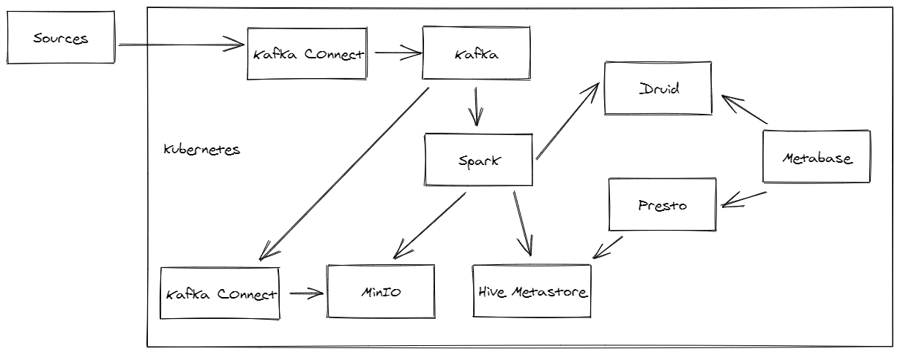

# k8sBigDataEnv
Big Data environment provided in Kubernetes.

### Sub Projects:
* Data Lake: https://github.com/CaioSGoncalves/k8sDataLake
* Data Processing: https://github.com/CaioSGoncalves/k8sDataProcessing
* Kafka Platform: https://github.com/CaioSGoncalves/k8sKafkaPlatform

# Big Picture

 

Objectives:

    - Create a development environment to learn and test Big Data technologies.
    - Create a full infrastrucure for Big Data on Kubernetes.

| Layer       | k8s      | AWS        | GCP                |
|-------------|----------|------------|--------------------|
| Store       | MinIO    | s3         | Storage/BigQuery   |
| Process     | Spark    | EMR/Glue   | Dataproc/Dataflow  |
| Query       | Presto   | Athena     | BigQuery           |
| Visualize   | Metabase | Quicksight | DataStudio         |
| Serve       | Hive     | Redshift   | BigQuery           |
| Orquestrate | Argo     | CloudWatch | Composer           |
| Stream      | Kafka    | Kinesis    | Pub/Sub + Dataflow |

How it works:

    - How it works
    

Folders:

    - ./storage: Store namespace and resources

References:

    - https://youtu.be/muTqsay1ix4
    - https://github.com/radanalyticsio/spark-operator

